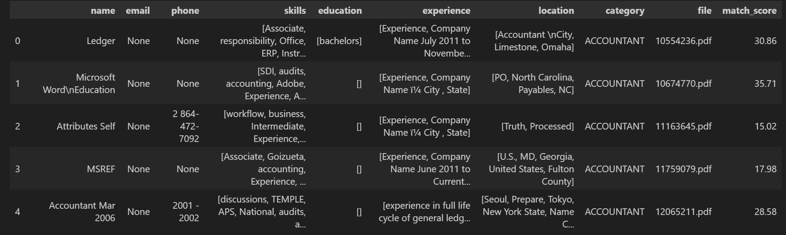
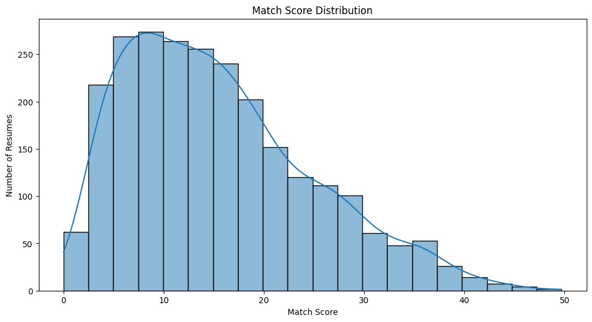

# 📄 Resume Parser & Job Matcher (Mini ATS)

A mini Applicant Tracking System (ATS) that extracts structured information from resumes and matches them against job descriptions using **NLP**.

---

## 🚀 Overview

This project automates the resume screening process by:
- Parsing key fields (name, email, skills, experience, etc.)
- Matching candidate resumes against job descriptions
- Scoring each resume based on keyword similarity
- Visualizing match score distributions for better hiring insights

---

## 🧠 Technologies Used

- **Python** – Core implementation
- **Pandas** – For data manipulation
- **spaCy / NLTK** – For text processing (NLP)
- **Sklearn / FuzzyWuzzy** – For scoring and matching logic
- **Matplotlib / Seaborn** – For score visualization

---

## 📊 Sample Visualizations

### 📋 Title: Data

Displays parsed resume fields and extracted content such as name, email, skills, experience, and education.

---

### 📈 Title: Match Score Distribution

Shows how resumes are scored based on how well they match the given job description.

---

## ⚙️ How It Works

1. **Parse Resume PDFs** using text extraction & regex
2. **Extract Keywords** from job descriptions
3. **Compare Skills & Experience** using NLP + fuzzy matching
4. **Score Matches** and sort best-fit candidates
5. **Visualize** match scores to analyze results

---

## ✨ Features

- Extracts structured data from resumes
- Uses NLP for smart keyword comparison
- Generates match scores with visual feedback
- Easy to extend into a full-scale ATS

---

